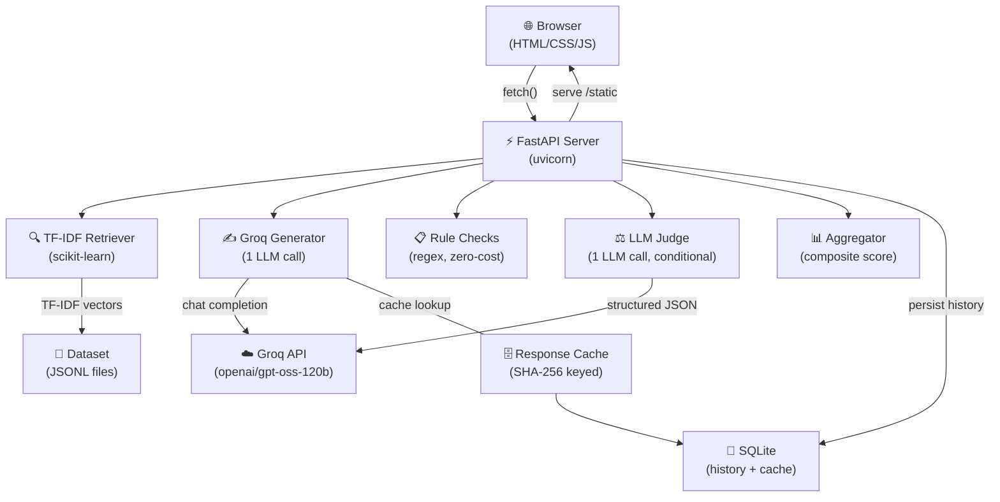
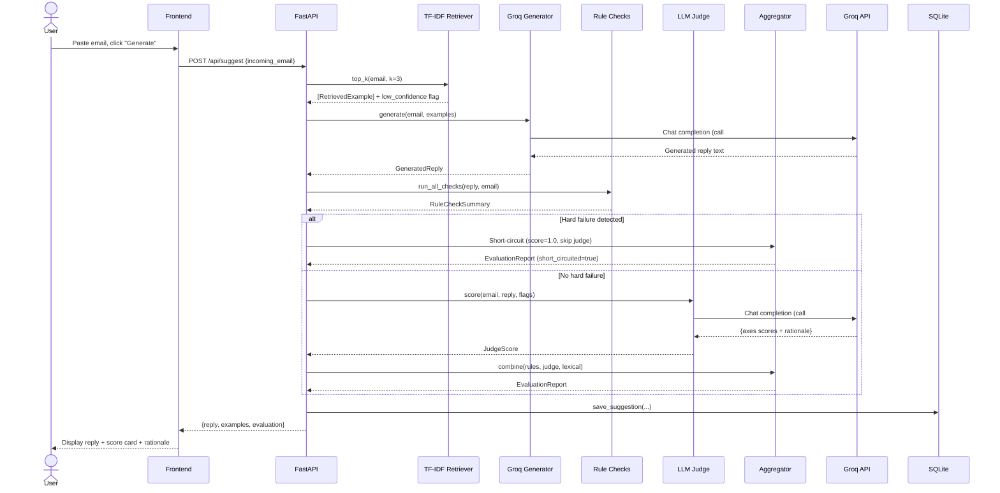
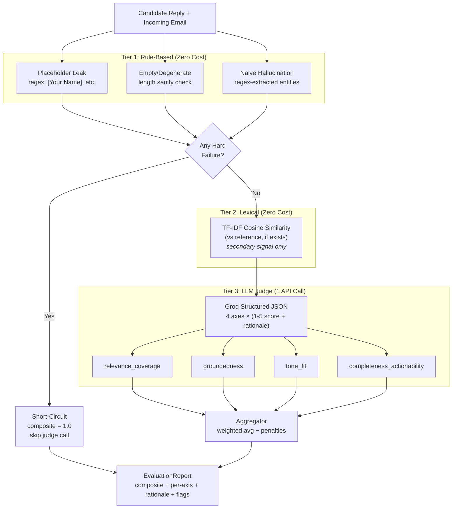
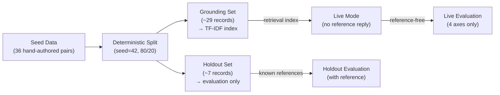
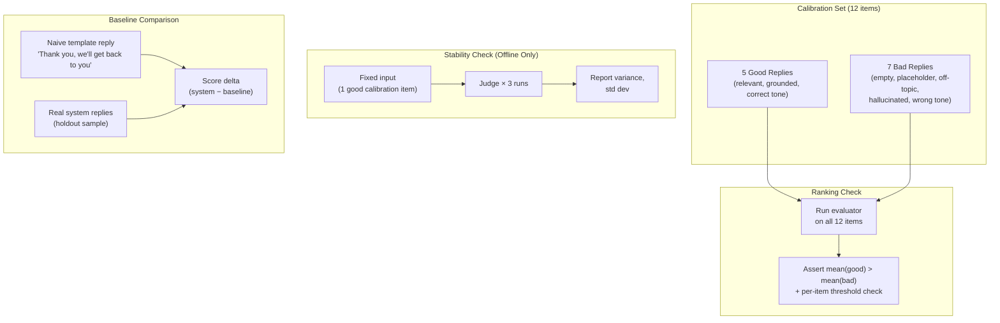

# Email Reply Suggestion System

**Live Demo:** [https://huggingface.co/spaces/pradeeshsivaprakasam/Email-Reply-Suggestion-System](https://huggingface.co/spaces/pradeeshsivaprakasam/Email-Reply-Suggestion-System)


An AI email assistant that drafts suggested replies using retrieval-augmented generation (RAG) via the Groq API, and **scores its own suggestions** on multiple axes with written rationale — so a reviewer knows not just "here's a draft" but "here's how good this draft is and why."

> **Key differentiator:** The evaluation system is the core deliverable. It's a tiered, multi-axis scoring pipeline with calibration validation — not a single fuzzy similarity number.

---

## Table of Contents

- [How to Run the Project (The Easy Way)](#how-to-run-the-project-the-easy-way)
- [How AI Tools Were Used](#how-ai-tools-were-used)
- [Architecture](#architecture)
- [Dataset](#dataset)
- [Evaluation System](#evaluation-system)
- [Cost-Control Decisions](#cost-control-decisions)
- [API Reference](#api-reference)
- [Scripts](#scripts)
- [Testing](#testing)
- [Limitations](#limitations)

---

## How to Run the Project (The Easy Way)

### Prerequisites

- Python 3.11+
- A [Groq API key](https://console.groq.com/) (free tier works)

### Setup

```bash
# 1. Clone and enter the project
cd email-reply-system

# 2. Copy environment template and add your API key
cp .env.example .env
# Edit .env and set GROQ_API_KEY=gsk_your_key_here

# 3. Install dependencies
uv sync

# 4. Build the dataset (runs without API key)
uv run backend/scripts/build_dataset.py

# 5. Start the server
uv run uvicorn backend.app.main:app --reload
```

Or use the one-command launcher:

```bash
chmod +x run.sh && ./run.sh
```

Open `http://localhost:8000` in your browser.

### Run evaluation scripts

```bash
# Holdout evaluation (requires GROQ_API_KEY)
uv run backend/scripts/run_holdout_eval.py

# Calibration checks (requires GROQ_API_KEY)
uv run backend/scripts/run_calibration.py

# Tests (fully offline — no API key needed)
uv run pytest backend/tests/ -v
```

### Deployment (Docker & Hugging Face Spaces)

This project includes a `Dockerfile` specifically configured to be deployed seamlessly on **Hugging Face Spaces** (Docker Spaces).

**To deploy to Hugging Face Spaces:**
1. Create a new Space on Hugging Face and select **Docker** as the environment.
2. Push this repository to your Space.
3. In the Space settings, add your `GROQ_API_KEY` as a Secret.
4. The space will automatically build and serve the app on port 7860.

**To run locally with Docker Compose:**
```bash
# Ensure your .env file is created and contains your GROQ_API_KEY
docker-compose up --build
```
The application will be available at `http://localhost:7860`.

---

## How AI Tools Were Used

The architecture, design trade-offs, and evaluation criteria for this project were planned and defined by me. To accelerate the implementation of the prototype, I used **AI-assisted coding tools (specifically, Gemini/Claude models within a custom agentic IDE)**.

The AI tools were used primarily for:
- Writing boilerplate code (FastAPI routing, Pydantic schemas, dependency injection)
- Writing unit and integration tests based on my specifications
- Generating the UI (HTML/CSS) based on my design constraints (clean, basic UI)
- Scaffolding the `uv` package management and initial `run.sh` script

I acted as the architect and reviewer, ensuring the AI strictly adhered to the constraints (e.g., exactly 1 LLM call for generation, short-circuiting the judge on rule failures, using TF-IDF instead of embeddings).

---

## Architecture

### System Architecture



### Sequence Diagram — `/api/suggest` Call



### Evaluation Pipeline Flowchart



### Dataset & Holdout Flow



### Calibration & Validation Flow



---

## Dataset

### Provenance

The dataset is **hand-authored** (by the agent) — 36 email/reply pairs across 6 categories:

| Category | Count | Description |
|----------|-------|-------------|
| `customer_support` | 6 | Order issues, password resets, refunds, subscriptions |
| `sales_inquiry` | 6 | Enterprise pricing, trials, partnerships, comparisons |
| `scheduling` | 6 | Meeting coordination, rescheduling, coverage |
| `billing_invoice` | 6 | Invoice disputes, payment issues, tax exemptions |
| `complaint_escalation` | 6 | Service failures, data loss, escalations |
| `internal_coordination` | 6 | Design reviews, deployments, cross-team comms |

### Why synthetic, not scraped

We deliberately chose hand-authored data over scraping (e.g., Enron corpus) for three reasons:

1. **Clean pairing**: Each record is a single incoming email → single reply, not a messy thread that needs parsing
2. **No PII/licensing**: No real names, addresses, or copyrighted content
3. **Controlled distribution**: Category, tone, urgency, and sender-role coverage is deliberate, not hoped-for

**Honest framing**: Synthetic data can't claim to be "real" business email. But it can be *representative by construction* — the category/tone distribution is deliberately controlled rather than accidentally skewed by whatever was in a public dump.

### Metadata

Each record includes:
- `tone`: formal | casual
- `sender_role`: customer | colleague | vendor
- `urgency`: low | medium | high

### Split

Deterministic 80/20 split (seed=42):
- **Grounding set** (~29 records): used to build the TF-IDF retrieval index
- **Holdout set** (~7 records): used only for evaluation with known reference replies, never seen by the retriever

---

## Evaluation System

### Why not exact match?

A suggested reply is "accurate" if it competently and appropriately handles the incoming email. There is **no single correct reply** — two very different replies can both be excellent. Therefore:

- We reject single-number metrics like BLEU, ROUGE, or exact-match accuracy
- We use **multi-axis scoring** where each axis captures a distinct quality dimension
- Lexical similarity to a reference reply is reported as a **secondary sanity signal only**, never folded into the composite score

### Scoring Axes (1-5 each)

| Axis | What it measures |
|------|-----------------|
| `relevance_coverage` | Does it address every distinct ask in the incoming email? |
| `groundedness` | Does it avoid inventing commitments/facts/numbers? |
| `tone_fit` | Does it match the register implied by the email? |
| `completeness_actionability` | Sign-off, next steps, nothing left dangling? |

### Composite Score

**Composite = weighted average of 4 judge axes − rule-based penalties**

**Weights**: Equal (0.25 each). Rationale: with no empirical data on which axis matters more for business email quality, equal weighting is the honest default. Unequal weights would imply a preference we can't justify.

**Rule penalties**: −0.25 per soft rule flag (e.g., hallucination flags). Hard failures (placeholder leak, empty reply) short-circuit entirely → composite = 1.0.

**Lexical similarity**: Explicitly **excluded** from the composite. This is the single most important accuracy-definition decision in the project. Reason: two replies can say the same thing in completely different words — penalizing lexical divergence would penalize valid diversity. It's reported separately as a sanity check for holdout evaluation.

### Tiered Pipeline (Cost-Optimized)

1. **Rule-based checks** (zero cost): regex for placeholders, length sanity, naive hallucination flags
2. **Lexical similarity** (zero cost): TF-IDF cosine vs reference reply, when available
3. **LLM judge** (1 API call): all 4 axes scored in a single structured JSON response
4. **Aggregator**: combines all tiers into `EvaluationReport`

### Validation

The metric is validated, not just computed:

1. **Calibration ranking**: 12 hand-labeled items (5 good, 7 bad). The evaluator must rank good items higher than bad items on average
2. **Judge stability**: Same input scored 3× — reports variance and std dev, quantifying how much to trust a single live score
3. **Baseline comparison**: Naive template reply ("Thank you, we'll get back to you") vs real system. If the delta isn't clearly positive, the metric isn't discriminating

### Per-Response Report Example

```json
{
  "rule_checks": {
    "checks": [
      {"name": "placeholder_leak", "passed": true, "detail": "No placeholders detected"},
      {"name": "empty_or_degenerate", "passed": true, "detail": "Length is reasonable"},
      {"name": "naive_hallucination_flags", "passed": true, "detail": "No hallucination flags"}
    ],
    "any_hard_failure": false
  },
  "judge_scores": {
    "axes": [
      {"axis": "relevance_coverage", "score": 5, "rationale": "Addresses order status and timeline"},
      {"axis": "groundedness", "score": 4, "rationale": "All facts traceable to the email"},
      {"axis": "tone_fit", "score": 5, "rationale": "Professional, empathetic tone"},
      {"axis": "completeness_actionability", "score": 4, "rationale": "Clear next steps provided"}
    ],
    "overall_rationale": "Strong reply that addresses all customer concerns."
  },
  "composite_score": 4.5,
  "lexical_similarity": null,
  "short_circuited": false
}
```

---

## Cost-Control Decisions

Every decision here trades cost against accuracy. Each is stated explicitly:

| Decision | Cost Saved | Accuracy Trade-off |
|----------|-----------|-------------------|
| **1 LLM call for generation** | 0 extra calls | None — this is the minimum viable generation |
| **1 LLM call for judging (all 4 axes)** | 3 calls saved vs per-axis judging | Minor — one prompt can score multiple axes competently |
| **Short-circuit on hard failure** | 1 call saved per broken reply | None — broken replies don't need nuanced scoring |
| **TF-IDF instead of embedding models** | No embedding API calls, no GPU, no torch | Lexical-only matching (no semantic similarity) — adequate at this scale |
| **Response cache (SHA-256 keyed)** | All duplicate calls saved | None — identical inputs produce identical outputs |
| **Stability/calibration runs offline only** | N calls saved per live request | Stability is a validation metric, not a per-request feature |
| **Model configurable via env vars** | Swap to `openai/gpt-oss-20b` without code changes | Smaller model = cheaper but potentially lower quality |

### Why TF-IDF and not embeddings?

At this dataset scale (36 records), TF-IDF is:
- **Adequate**: lexical overlap is a reasonable similarity signal for business emails with shared vocabulary
- **Honest**: we don't hide that it's lexical-only
- **Zero-cost**: no embedding API calls, no local model downloads, no GPU
- **Fast**: installs in seconds, runs in milliseconds

The trade-off is no semantic similarity — "I want a refund" and "please return my money" would have low TF-IDF overlap despite being semantically identical. At scale, this would matter; at 36 records with deliberate category structure, it works well enough to be worth the massive cost/complexity savings.

---

## API Reference

| Method | Endpoint | Description |
|--------|----------|-------------|
| `POST` | `/api/suggest` | Generate a reply + evaluate it (2 LLM calls max) |
| `POST` | `/api/evaluate` | Evaluate an arbitrary candidate reply |
| `GET` | `/api/dataset/stats` | Dataset counts, distributions, split sizes |
| `POST` | `/api/holdout-eval` | Batch evaluate the holdout split |
| `GET` | `/api/holdout-eval/latest` | Fetch the most recent holdout report |
| `POST` | `/api/calibration-report/run` | Run calibration + stability + baseline |
| `GET` | `/api/calibration-report` | Fetch the most recent calibration report |
| `GET` | `/api/history` | Recent suggestions from SQLite |

Interactive API docs: `http://localhost:8000/docs` (Swagger UI)

---

## Scripts

```bash
# Build/regenerate the dataset (no API key needed)
uv run backend/scripts/build_dataset.py

# Augment with N Groq-generated synthetic pairs
uv run backend/scripts/build_dataset.py --augment 10

# Run holdout evaluation
uv run backend/scripts/run_holdout_eval.py

# Run calibration (all checks)
uv run backend/scripts/run_calibration.py

# Run calibration (skip expensive checks)
uv run backend/scripts/run_calibration.py --skip-stability --skip-baseline
```

---

## Testing

```bash
# Run all tests (fully offline — no API key or network needed)
uv run pytest backend/tests/ -v
```

### Test coverage

| Test File | What it tests |
|-----------|--------------|
| `test_retrieval.py` | TF-IDF indexing, ranking, confidence flags |
| `test_rule_checks.py` | Placeholder detection, length checks, hallucination flags |
| `test_lexical_similarity.py` | TF-IDF cosine similarity edge cases |
| `test_aggregator.py` | **Short-circuit behavior** (judge not called on hard failure), composite clamping |
| `test_llm_judge.py` | JSON parsing, score clamping, single-call enforcement |
| `test_calibration_sanity.py` | **Integration**: good items outscore bad items by ≥0.5 gap |

All tests mock the Groq client at the `infra/groq_client.py` boundary — no network access needed.

---

## Limitations

Stated honestly:

1. **TF-IDF is lexical, not semantic**: "I want a refund" and "please return my money" have low lexical overlap despite being semantically identical. At 36 records this is adequate; at scale, an embedding-based retriever would be better.

2. **Hallucination check is regex-heuristic, not NER**: It catches fabricated numbers, dates, and capitalized phrases, but misses subtle factual fabrications. The LLM judge is the real safety net for groundedness.

3. **Dataset is synthetic**: Hand-authored data can be representative by construction but can't claim to capture the full messiness of real business email (typos, forwarded chains, attachments, multi-language).

4. **Judge variance**: LLM judges are inherently stochastic. The stability check quantifies this — if std dev is high, a single live score should be interpreted with appropriate uncertainty.

5. **No semantic deduplication**: The cache is keyed by exact content hash, not semantic equivalence. Slightly rephrased identical emails will trigger separate LLM calls.

6. **Single-turn only**: The system handles one incoming email → one reply. It doesn't handle email threads, forwarded chains, or multi-turn conversations.

---

## Repository Structure

```
email-reply-system/
├── README.md
├── requirements.txt
├── .env.example
├── .gitignore
├── run.sh
├── backend/
│   ├── app/
│   │   ├── main.py                    # FastAPI app + startup initialization
│   │   ├── api/routes/                # 6 route modules
│   │   ├── core/                      # config (pydantic-settings) + logging
│   │   ├── domain/schemas.py          # ALL pydantic models
│   │   ├── services/
│   │   │   ├── retrieval/             # ABC + TF-IDF implementation
│   │   │   ├── generation/            # ABC + Groq implementation + prompts
│   │   │   ├── evaluation/            # ABC + rule checks + lexical + judge + aggregator
│   │   │   ├── dataset/               # schema + loader + splitter
│   │   │   └── calibration/           # runner + stability + baseline
│   │   └── infra/                     # groq_client + cache + db
│   ├── data/                          # JSONL dataset + calibration set
│   ├── scripts/                       # CLI tools
│   └── tests/                         # unit + integration
└── frontend/                          # HTML + CSS + JS (no build step)
```

---

## Environment Variables

| Variable | Default | Description |
|----------|---------|-------------|
| `GROQ_API_KEY` | (required) | Your Groq API key |
| `GROQ_MODEL_GENERATOR` | `openai/gpt-oss-120b` | Model for reply generation |
| `GROQ_MODEL_JUDGE` | `openai/gpt-oss-120b` | Model for quality judging |
| `RETRIEVAL_TOP_K` | `3` | Number of examples to retrieve |
| `RETRIEVAL_CONFIDENCE_THRESHOLD` | `0.15` | Below this, flag low confidence |
| `WEIGHT_RELEVANCE` | `0.25` | Composite weight for relevance axis |
| `WEIGHT_GROUNDEDNESS` | `0.25` | Composite weight for groundedness axis |
| `WEIGHT_TONE` | `0.25` | Composite weight for tone axis |
| `WEIGHT_COMPLETENESS` | `0.25` | Composite weight for completeness axis |
| `RULE_HARD_FAILURE_PENALTY` | `1.0` | Penalty per hard rule failure |
| `PASS_THRESHOLD` | `3.0` | Composite score threshold for "pass" |
| `STABILITY_RERUNS` | `3` | Number of judge re-runs for stability check |

To use the cheaper model: set `GROQ_MODEL_GENERATOR=openai/gpt-oss-20b` and `GROQ_MODEL_JUDGE=openai/gpt-oss-20b` in `.env`.
